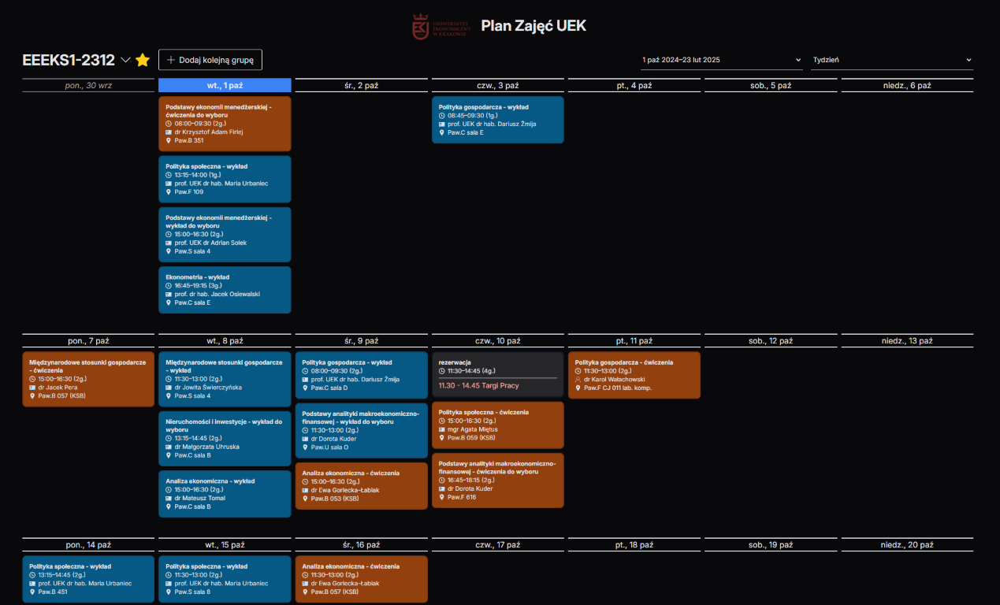
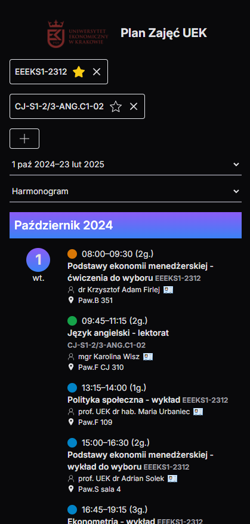

# [UEK - plan zajęć](https://uek-planzajec-v2.pages.dev/)

**Wrapper around official [UEK Plan Zajęć](https://planzajec.uek.krakow.pl) with nice new features**

| Desktop                                            | Mobile                                            |
| -------------------------------------------------- | ------------------------------------------------- |
|  |  |

✅ View multiple schedules at once (up to 3, e.g. main group + language groups)  
✅ Mark schedules as favorite to come back to them quickly (if you're too stupid to use a bookmark or to just keep a tab open)  
✅ Multiple nice looking schedules views  
✅ 100% functionality without JS  
✅ Multiple languages (pl/en) with internationalised paths  
✅ Caching on Cloudflare for performance (+to avoid ddosing UEK)

[V1](https://github.com/szczursonn/uek-planzajec) with NextJS Page Router

## Cloudflare Pages Config

1. Bump node version to at least 20
2. Enable compatibility flag on project: nodejs_compat_v2

## TODO / potential improvements

-   PWA
-   more efficient handling of dates
-   export to csv/xlsx
-   show upcoming classes
-   fix performance issue on picker if too many links (~300ms lag due to inefficient link translation from paraglidejs)
-   some confirmation on UI when adding/deleting favorite schedule (toast?)
